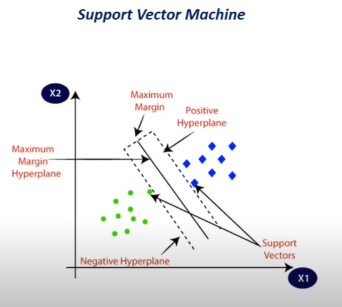
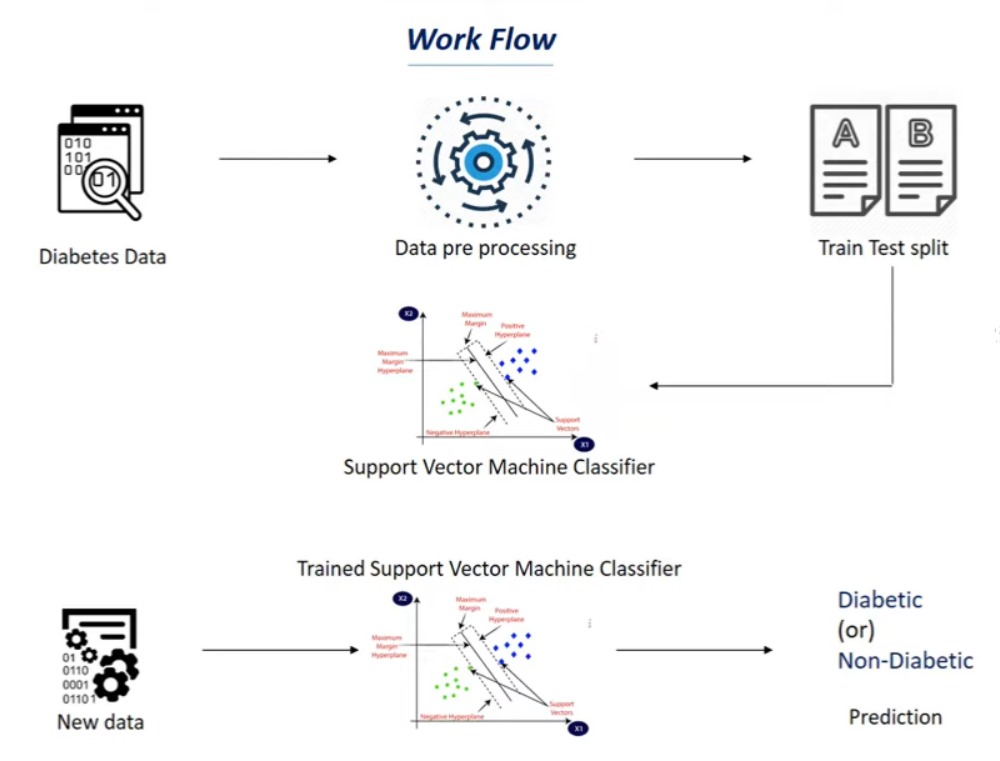

# Diabetes-Prediction
Building a system that can predict whether a person has diabetes or not with the help of Machine Learning. This project is done in Python. In this project, we use Support Vector Machine model for the prediction.
 
<a href="https://www.dropbox.com/s/uh7o7uyeghqkhoy/diabetes.csv?dl=0">Dataset Link</a>
 

 

